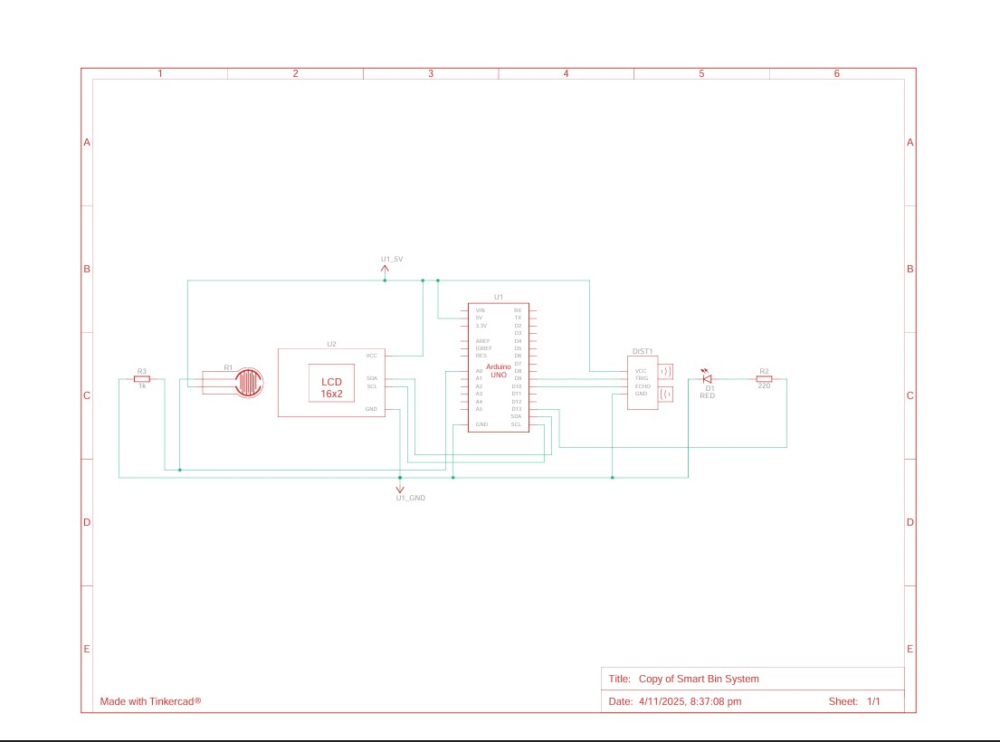
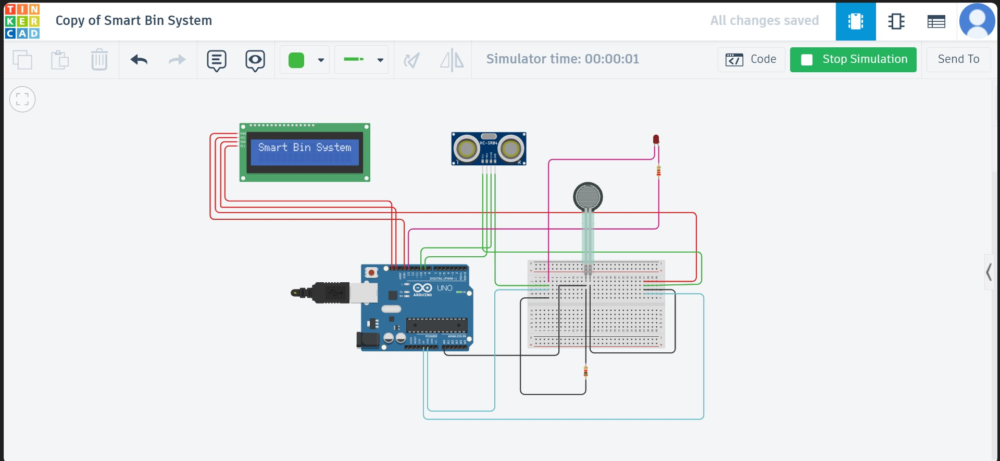

# 🗑️ Smart Bin System

A simple IoT-based smart waste management system that detects the waste level using ultrasonic sensors and alerts when the bin is full.  
The project is designed to promote automation in waste monitoring and management using Arduino and basic sensors.

---

## 🚀 Features
- 🔊 Detects the waste level using an ultrasonic sensor  
- ⚖️ Detects the weight of waste using a force sensor  
- 💡 LCD display for real-time status and distance updates  
- 🚨 LED indicator when the bin is full  
- 🌐 Can be extended with IoT modules like WiFi or GSM for remote monitoring  

---

## 🧩 Components Required
| Component | Quantity | Description |
|------------|-----------|-------------|
| Arduino Uno R3 | 1 | Microcontroller board |
| Ultrasonic Sensor (HC-SR04) | 1 | Measures distance (waste level) |
| Force Sensor | 1 | Detects weight inside the bin |
| MCP23008-based, 32 (0x20) LCD 16x2 (I2C) | 1 | Displays status and readings |
| Breadboard | 1 | Circuit connections |
| Jumper Wires | Several | To connect components |
| Red LED | 1 | Indicates “Bin Full” |
| 220Ω,and 1KΩ Resistors | 2 | For current control |

---

## ⚙️ Circuit Setup

1. Connect the **Ultrasonic Sensor** to pins 9 and 10 (Trig and Echo).  
2. Connect the **Force Sensor** to analog pin A0.  
3. Connect the **LCD** to I2C or directly to digital pins (as configured).  
4. Connect the **LED** to pin 13.  
5. Upload the `smart_bin.ino` code to your Arduino board.

---

## 💻 Code File

All Arduino logic is inside:
`smart_bin.ino`
It contains the code for:
- Distance measurement  
- Weight detection  
- Display and alert control  

---

## 📸 Circuit & Simulation

### 🧭 Circuit Diagram

### 🧠 Tinkercad Simulation

---

## 📜 Report
Detailed explanation, working, and simulation screenshots are included in:  
📄 **Smart_Bin_Report.pdf**

---

## 🧑‍💻 Author

**Jayanti**  
🎓 *Information Science & Engineering Student*  
💬 Passionate about IoT, Automation, and Embedded Systems  
🌐 [GitHub Profile](https://github.com/jayanti1008)

---

⭐ If you like this project, don’t forget to give it a star!